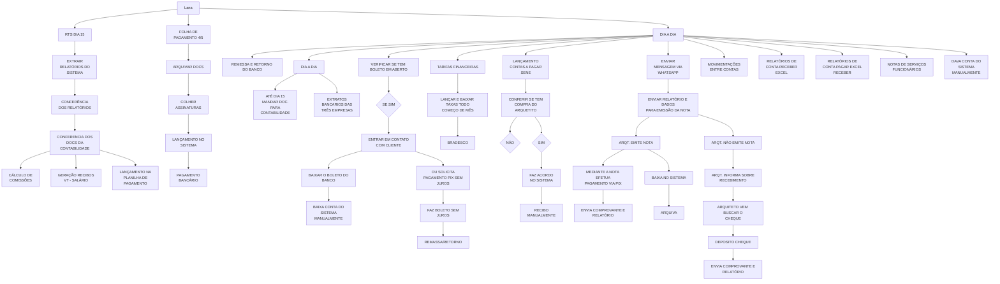

# Lana - Processos Financeiros

Fonte: board Miro "fluxograma Lucenera" (consolidado), widget "Lana". Texto fiel ao board (mantidos erros de digitação originais, ex.: "AGUALDO", "REMASSA").

```mermaid
flowchart TD
    A[Lana] --> B[RTS DIA 15]
    A --> C[FOLHA DE\nPAGAMENTO 4/5]
    A --> D[DIA A DIA]

    B --> E[EXTRAIR\nRELATÓRIOS DO\nSISTEMA]
    E --> F[CONFERÊNCIA\nDOS RELATÓRIOS]
    F --> G[CONFERENCIA DOS\nDOCS DA\nCONTABILIDADE]

    G --> H[CÁLCULO DE\nCOMISSÕES]
    G --> I[GERAÇÃO RECIBOS\nVT - SALÁRIO]
    G --> J[LANÇAMENTO NA\nPLANILHA DE\nPAGAMENTO]

    C --> K[ARQUIVAR DOCS]
    K --> L[COLHER\nASSINATURAS]
    L --> M[LANÇAMENTO NO\nSISTEMA]
    M --> N[PAGAMENTO\nBANCÁRIO]

    D --> O[REMESSA E RETORNO DO BANCO]
    D --> P[DIA A DIA]
    P --> Q[ATÉ DIA 15\nMANDAR DOC.\nPARA\nCONTABILIDADE]
    P --> R[EXTRATOS\nBANCARIOS DAS\nTRÊS EMPRESAS]

    D --> S[VERIFICAR SE TEM BOLETO EM ABERTO]
    S --> T{SE SIM}
    T --> U[ENTRAR EM CONTATO\nCOM CLIENTE]
    U --> V[OU SOLICITA\nPAGAMENTO PIX SEM\nJUROS]
    U --> W[BAIXAR O BOLETO DO\nBANCO]
    W --> X[BAIXA CONTA DO\nSISTEMA\nMANUALMENTE]

    V --> Y[FAZ BOLETO SEM\nJUROS]
    Y --> Z[REMASSA/RETORNO]

    D --> AA[TARIFAS FINANCEIRAS]
    AA --> AB[LANÇAR E BAIXAR TAXAS TODO\nCOMEÇO DE MÊS]
    AB --> AC[BRADESCO]

    D --> AD[LANÇAMENTO\nCONTAS A PAGAR\nSENE]
    AD --> AE[CONFERIR SE TEM\nCOMPRA DO\nARQUETITO]
    AE --> AF{NÃO}
    AE --> AG{SIM}
    AG --> AH[FAZ ACORDO\nNO SISTEMA]
    AH --> AI[RECIBO\nMANUALMENTE]

    D --> AJ[ENVIAR\nMENSAGEM VIA\nWHATSAPP]
    AJ --> AK[ENVIAR RELATÓRIO E DADOS\nPARA EMISSÃO DA NOTA]
    AK --> AL[ARQT. EMITE NOTA]
    AL --> AM[MEDIANTE A NOTA EFETUA\nPAGAMENTO VIA PIX]
    AM --> AN[ENVIA COMPROVANTE E\nRELATÓRIO]
    AL --> AO[BAIXA NO SISTEMA]
    AO --> AP[ARQUIVA]

    AK --> AQ[ARQT. NÃO EMITE NOTA]
    AQ --> AR[ARQT. INFORMA SOBRE\nRECEBIMENTO]
    AR --> AS[ARQUITETO VEM BUSCAR O\nCHEQUE]
    AS --> AT[DEPOSITO CHEQUE]
    AT --> AU[ENVIA COMPROVANTE E\nRELATÓRIO]

    D --> AV[MOVIMENTAÇÕES\nENTRE CONTAS]
    D --> AW[RELATÓRIOS DE\nCONTA RECEBER\nEXCEL]
    D --> AX[RELATÓRIOS DE\nCONTA PAGAR EXCEL\nRECEBER]
    D --> AY[NOTAS DE SERVIÇOS\nFUNCIONÁRIOS]
    D --> AZ[DAVA CONTA DO\nSISTEMA\nMANUALMENTE]
```
