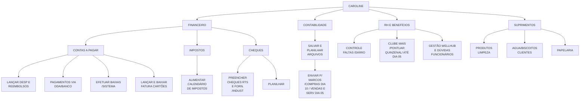

# Caroline - Funções e Responsabilidades

Fonte: board Miro "fluxograma Lucenera" (consolidado), widget "Caroline". Texto fiel ao board.

```mermaid
flowchart TD
    A[CAROLINE] --> B[FINANCEIRO]
    A --> C[CONTABILIDADE]
    A --> D[RH E BENEFÍCIOS]
    A --> E[SUPRIMENTOS]

    B --> B1[CONTAS A PAGAR]
    B --> B2[IMPOSTOS]
    B --> B3[CHEQUES]

    B1 --> C1[LANÇAR DESP E\nREEMBOLSOS]
    B1 --> C2[PAGAMENTOS VIA\nDDA/BANCO]
    B1 --> C3[EFETUAR BAIXAS\n/SISTEMA]
    B1 --> C4[LANÇAR E BAIXAR\nFATURA CARTÕES]

    B2 --> D1[ALIMENTAR\nCALENDÁRIO\nDE IMPOSTOS]

    B3 --> E1[PREENCHER\nCHEQUES RTS\nE FORN.\n/INDUST]
    B3 --> E2[PLANILHAR]

    C --> F1[SALVAR E\nPLANILHAR\nARQUIVOS]
    F1 --> G1[ENVIAR P/\nMARCOS\n/COMPRAS DIA\n10 / VENDAS E\nSERV DIA 05]

    D --> H1[CONTROLE\nFALTAS /DIÁRIO]
    D --> H2[CLUBE MAIS\n/PONTUAR\nQUINZENAL/ ATÉ\nDIA 05]
    D --> H3[GESTÃO WELLHUB\nE DÚVIDAS\nFUNCIONÁRIOS]

    E --> I1[PRODUTOS\nLIMPEZA]
    E --> I2[AGUA/BISCOITOS\nCLIENTES]
    E --> I3[PAPELARIA]
```
