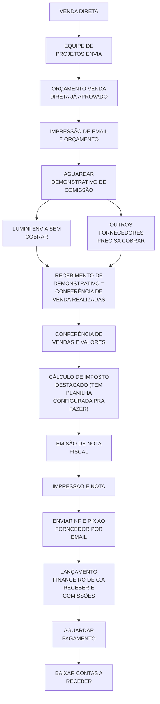

# Venda Direta

Fonte: board Miro "fluxograma Lucenera" (consolidado), widget "Venda Direta". Texto fiel ao board, incluindo erros de digitação originais (ex.: "EMISÃO", "FORNCEDOR").

```mermaid
flowchart TD
    A2[VENDA DIRETA] --> B2["EQUIPE DE\nPROJETOS ENVIA"]
    B2 --> C2["ORÇAMENTO VENDA\nDIRETA JÁ APROVADO"]
    C2 --> D2["IMPRESSÃO DE EMAIL\nE ORÇAMENTO"]
    D2 --> E2["AGUARDAR\nDEMONSTRATIVO DE\nCOMISSÃO"]
    E2 --> F2a["LUMINI ENVIA SEM\nCOBRAR"]
    E2 --> F2b["OUTROS\nFORNECEDORES\nPRECISA COBRAR"]
    F2a --> G2["RECEBIMENTO DE\nDEMONSTRATIVO =\nCONFERÊNCIA DE\nVENDA REALIZADAS"]
    F2b --> G2
    G2 --> H2["CONFERÊNCIA DE\nVENDAS E VALORES"]
    H2 --> I2["CÁLCULO DE IMPOSTO\nDESTACADO (TEM\nPLANILHA\nCONFIGURADA PRA\nFAZER)"]
    I2 --> J2["EMISÃO DE NOTA\nFISCAL"]
    J2 --> K2["IMPRESSÃO E NOTA"]
    K2 --> L2["ENVIAR NF E PIX AO\nFORNCEDOR POR\nEMAIL"]
    L2 --> M2["LANÇAMENTO\nFINANCEIRO DE C.A\nRECEBER E\nCOMISSÕES"]
    M2 --> N2["AGUARDAR\nPAGAMENTO"]
    N2 --> O2["BAIXAR CONTAS A\nRECEBER"]
```
